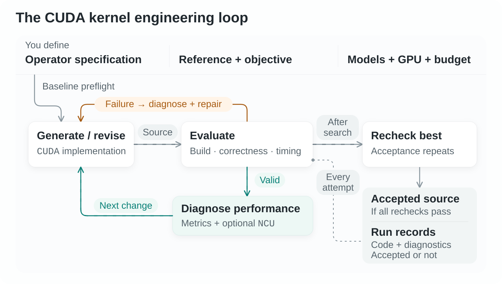
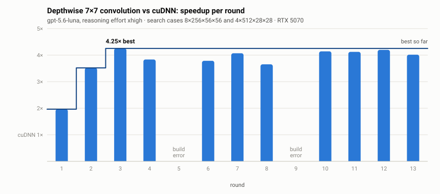
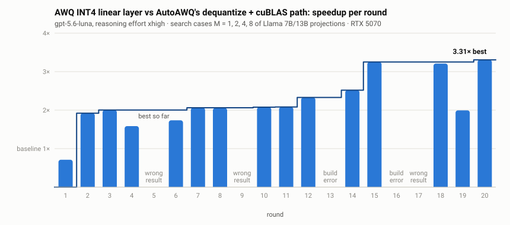

# KAI Pichu

### An open-source agent harness for CUDA kernel optimization.

[Get started](#get-started) · [How it works](#how-it-works) · [Define a task with your coding agent](#define-a-task-with-your-coding-agent) · [Documentation](#documentation) · [Research](#research-and-attribution)

At Accion Intelligence, we’re building KAI to make GPU engineering accessible from a specification. **KAI Pichu is the open-source agent harness underneath it:** a Benchmark SDK that turns an operator contract into a task no model can game, an optimization loop that drives any LLM you choose through generate, measure, profile and repair, and a run record you can audit line by line. It optimizes one GPU operator, or fuses one kernel pipeline, at a time. The Python package and CLI are `kai_pichu` / `kai-pichu`.

You define what the operator must do, how to check it, what to beat and what to time. The harness freezes that contract, keeps the inputs and the oracle out of the model's reach, measures every candidate in paired blocks with confidence intervals, and hands the model the evidence it needs: measured values, compiler errors, Nsight Compute counters. You choose the models, hardware and budget; the code and experiment records remain yours.

**Writing the task is the hard part, so the SDK ships with a skill for Claude Code and Codex.** `kai-pichu skill install`, then tell your agent which operator to wrap: it follows the packaged manual, keeps the test data hidden from the optimizer, and shows you the contract before anything runs.

<picture>
  <source media="(prefers-reduced-motion: reduce) and (prefers-color-scheme: dark)" srcset="docs/assets/kai-pichu-workflow-dark.png">
  <source media="(prefers-reduced-motion: reduce)" srcset="docs/assets/kai-pichu-workflow-light.png">
  <source media="(prefers-color-scheme: dark)" srcset="docs/assets/kai-pichu-workflow-dark.svg">
  
</picture>

## How it works

**Three parts: a Benchmark SDK, an optimization loop, and a record of the work.**

- **Benchmark SDK.** A task is a manifest plus an adapter: cases per split, input synthesis, an independent oracle, deliberately wrong outputs the validator must reject, and a declared timing boundary. Search and acceptance splits span the same input ranges; the model sees search results only. The SDK times both implementations in interleaved paired blocks and reports the geometric-mean speedup with bootstrap intervals alongside every case's own speedup; cases below a declared regression margin are flagged for review. `kind: fusion` tasks hand the model kernels you already have, read-only, and ask for fewer launches.
- **Optimization loop.** Any model behind an OpenAI-compatible, Responses or Anthropic endpoint plays generator and judge:

  - *Generate and repair.* The generator writes the permitted implementation files. Build or correctness failures go to a diagnostic judge, which identifies one issue and proposes a focused repair.
  - *Investigate and optimize.* For valid candidates the judge reads the measured baseline and candidate values and, when enabled, an Nsight Compute profile of the search case where the candidate gained least. It can query the captured profile before proposing one bottleneck hypothesis and one code change.
  - *Keep progress.* The loop builds on the latest candidate that passed every rule (correct, faster than the baseline overall, within every declared metric limit) and never ranks two passing candidates itself; the model sees every round's per-case numbers and decides. The highest-scoring candidate is kept for acceptance. Runs work within round, model-call and time budgets and resume after interruptions.
  - *Recheck.* After search, the best candidate is rerun on the held-out acceptance split and marked `accepted` only if every run passes.
- **Record of the work.** Every request, response, candidate, report and profile is a plain file in the run directory.

KAI Pichu is an **agent harness for engineering work**, not a fixed benchmark suite or a kernel library. Your task specifies the semantics, baseline, cases, precision and measurement boundary; the harness enforces them against whatever model you plug in.

## Get started

Use a Linux GPU environment with Python 3.10+, a CUDA toolchain, and the dependencies required by your operator. Bring your own model endpoint and GPU; NCU profiling is optional.

**1. Install from a source checkout**

From the repository root, in your Python environment:

```bash
python -m pip install -e .
python -m kai_pichu --help
```

<details>
<summary>Optional: check your GPU environment with the packaged depthwise convolution task</summary>

```bash
python -m kai_pichu benchmark validate examples/depthwise_conv/benchmark.yaml \
  --split search --output depthwise-preflight.json
```

This compiles the cuDNN baseline, runs task checks and baseline correctness on your GPU, and times the baseline, with **no model calls**. Add `--checks-only` to skip timing. It does not test your model endpoint or run the optimization loop. The task needs PyTorch (for its bundled cuDNN) and `nvcc` for your architecture; see [the example](examples/depthwise_conv/README.md).

</details>

**2. Define your operator**

A runnable task is a **manifest + adapter**: the contract for your operator and the code that prepares inputs, loads implementations and checks results. Let your coding agent write it with the packaged skill (next section), or author it by hand from the same manual:

```bash
python -m kai_pichu benchmark guide --output task-manual.md
python -m kai_pichu benchmark schema --output task-schema.json
python -m kai_pichu benchmark init /absolute/path/to/your-task --template stateless
```

[Task setup and exact commands →](docs/QUICKSTART.md#2-define-the-task)

**3. Configure, run, and inspect**

Export the model configuration, set your endpoint and budget, then start the loop against your reviewed task. The optimizer checks the baseline before making its first generation call.

```bash
python -m kai_pichu config --output optimizer.yaml
# Edit optimizer.yaml: model, endpoint, key variable, budget; enable NCU if available.
python -m kai_pichu optimize /absolute/path/to/your-task/benchmark.yaml \
  --config optimizer.yaml --output runs/my-operator
```

Add `--dry-run` to inspect the plan and frozen task bundle without model calls or GPU workload.

[Full setup, credentials, profiling, dry-run and resume →](docs/QUICKSTART.md)

## Define a task with your coding agent

The Benchmark SDK is the part of KAI Pichu you spend the most time with, and it is designed to be written by an agent under your review. It ships as a skill in the same format Claude Code and Codex read:

```bash
python -m kai_pichu skill install                 # ./.claude/skills and ./.codex/skills
python -m kai_pichu skill install --scope user    # ~/.claude/skills and ~/.codex/skills
```

Then, in your project, tell the agent what you have and what you want:

> Build a KAI task for my 7×7 depthwise convolution. Baseline is cuDNN, FP16 in and out, FP32 reference. Time the kernel alone.

The skill makes the agent settle the contract with you first (semantics, baseline, reference and tolerance, input domain, timed boundary, editable files), write the hidden side (inputs, oracle, adapter) before the model-visible side, define search and acceptance splits over the same ranges, verify every claim in the task description, run the SDK's validation on every split, and show you the contract before `kai-pichu optimize`. The same rules are in the manual (`kai-pichu benchmark guide`) for anyone writing a task by hand.

What the SDK enforces for every task, whoever writes it:

| Rule | Why |
| --- | --- |
| The adapter, input generation and oracle are never shown to the optimizing model | A candidate cannot specialize to the test data |
| Every case ships deliberately wrong outputs the validator must reject | A vacuous oracle is caught at preflight |
| Paired ABBA blocks, bootstrap intervals, per-case speedups reported beside the geometric mean | Ordinary GPU jitter is neither a speedup nor a regression, and a slow case cannot hide in an average |
| Frozen, fingerprinted task bundle | A run cannot be rescued by editing the task under it |

## Showcase: $1, 2 hours, 3.5× to 3.9× over cuDNN on held-out shapes

One packaged task, `gpt-5.6-luna` as generator and judge, 13 rounds, no target speedup. The best candidate reached **4.25× over cuDNN on the two search cases**; frozen and rerun twice on five held-out cases it never saw, it held a **geometric mean of 3.85× and 3.54×** and was faster than cuDNN on every case (RTX 5070).

<picture>
  <source media="(prefers-color-scheme: dark)" srcset="docs/assets/depthwise-showcase-dark.svg">
  
</picture>

| Held-out case (acceptance rerun) | cuDNN | KAI Pichu | Speedup |
| --- | --- | --- | --- |
| 8×256×56×56 | 0.710 ms | 0.133 ms | **5.3×** |
| 16×96×56×56 | 0.538 ms | 0.104 ms | **5.2×** |
| 4×192×57×61 | 0.314 ms | 0.067 ms | **4.7×** |
| 4×100×61×59 | 0.180 ms | 0.045 ms | **4.0×** |
| 2×768×14×14 | 0.056 ms | 0.037 ms | 1.5× |

Round 1 beat cuDNN with a shared-memory tile; the judge read the NCU profile, called the kernel issue-bound, and two rounds of register blocking took the search score to 4.25×. [Setup, per-round trajectory and what was left on the table →](docs/showcase-depthwise.md)

## Showcase: AWQ INT4 decode fusion, 3.4× geometric mean, up to 4.4× per shape

A `kind: fusion` task built on AutoAWQ's real kernels: the baseline dequantizes INT4 weights into an FP16 matrix and calls cuBLAS, exactly as AutoAWQ does. In 20 rounds `gpt-5.6-luna` fused them into one kernel that scored 3.31× on the search cases; on the held-out Llama shapes it is **4.4× faster than the two-stage path at M = 1 and M = 3**, **3.45× and 3.41× as a geometric mean** over two reruns, with no shape slower than the baseline.

<picture>
  <source media="(prefers-color-scheme: dark)" srcset="docs/assets/awq-showcase-dark.svg">
  
</picture>

| Held-out case | AutoAWQ two-stage | KAI Pichu | Speedup | AutoAWQ fused kernel |
| --- | --- | --- | --- | --- |
| 1×11008×4096 | 0.428 ms | 0.096 ms | **4.4×** | 5.1× |
| 2×4096×11008 | 0.605 ms | 0.149 ms | **4.1×** | 7.9× |
| 3×5120×13824 | 0.962 ms | 0.216 ms | **4.4×** | 9.1× |
| 8×4096×4096 | 0.158 ms | 0.084 ms | **1.9×** | 3.3× |

The judge's per-instruction stall attribution kept pointing at the same shuffle broadcast; replacing it with shared-memory staging and a `cp.async` pipeline took `M = 1` from 1.2× to 4.3× in three rounds. AutoAWQ's hand-written kernel is still ahead on every shape because it runs on tensor cores. [Setup and per-round trajectory →](docs/showcase-awq-fusion.md)

## What a run leaves behind

**No accepted candidate does not mean no useful work.** Inspect the attempts, diagnostics, and source changes, not just the final status.

```text
runs/my-operator/
├── summary.json        # final status, report links, time and model usage
├── state.json          # history, latest eligible and best candidates, reserved budgets
├── bundle/             # frozen task and baseline
├── candidates/         # generated implementation snapshots
├── llm/                # model requests, responses and errors
├── reports/            # evaluation reports and process logs
├── profiles/           # hardware evidence, when profiling ran
├── best_search/        # best eligible candidate, if one exists
├── best_search.patch   # its implementation changes, if one exists
└── accepted/           # source, only after final acceptance passes
```

A successful command exit alone does not mean a speedup was accepted. `accepted` means the supplied tests and rules passed. It is not a guarantee about untested inputs, other GPUs, or application-level latency.

## Measurements you can inspect

The benchmark SDK checks correctness against your reference, probes the validator with deliberately invalid observations, and compares candidates using paired measurements with confidence intervals. Final acceptance repeats evaluation on the acceptance split; whether its cases differ from search is determined by your adapter.

The SDK controls built-in timing; adapter-defined metrics require their own boundary review. File allowlists and integrity checks help preserve the task, but **this is not a security sandbox**. [Measurement rules and execution risks →](docs/MEASUREMENT.md)

## Documentation

| You want to… | Start here |
| --- | --- |
| Install, define a task and run the loop | [Quickstart](docs/QUICKSTART.md) |
| Read the full showcase runs | [Depthwise 7×7 against cuDNN](docs/showcase-depthwise.md), [AWQ INT4 fusion against AutoAWQ](docs/showcase-awq-fusion.md) |
| Write a task, by hand or with Claude Code / Codex | [Benchmark manual](src/kai_pichu/benchmark/MANUAL.md) (`kai-pichu benchmark guide`); the `kai-benchmark` skill from `kai-pichu skill install` follows it |
| Understand the Benchmark SDK's design | [Benchmark framework](docs/benchmark-framework.md) |
| Explore the packaged tasks | [Depthwise 7×7 convolution against cuDNN](examples/depthwise_conv/README.md), [FP16 attention example](examples/attention/README.md) |
| Fuse kernels you already have | [AWQ INT4 linear layer on AutoAWQ's kernels](examples/awq_linear_fusion/README.md), [epilogue fusion example](examples/fusion/README.md) (`kind: fusion`) |
| Understand the loop’s decisions and outputs | [Workflow](docs/WORKFLOW.md) |
| Understand correctness, timing, and acceptance | [Measurement](docs/MEASUREMENT.md) |

## Contributing

Bring a new operator, an interesting failure, a better diagnostic strategy, or results from another GPU. Share the task, environment, relevant logs, and code change, not just a speedup ratio. Remove credentials and proprietary material first. See [CONTRIBUTING.md](CONTRIBUTING.md).

## Research and attribution

The profile query layer, one narrow question per call over a captured Nsight Compute report, is inspired by [VeloQ](https://github.com/lucifer1004/veloq). The optimization loop builds on the CUDA generation and hardware-feedback workflow of **[CudaForge](https://arxiv.org/abs/2511.01884)** and **[StitchCUDA](https://icml.cc/virtual/2026/poster/64924)**. Its optimizer source history and retained MIT notices are documented in the repository. The task design and evaluation methodology draw on **[CUDAHercules](https://arxiv.org/abs/2605.08467)**.

If KAI Pichu supports your work, please cite the relevant papers:

```bibtex
@misc{zhang2025cudaforge,
  title = {CudaForge: An Agent Framework with Hardware Feedback for CUDA Kernel Optimization},
  author = {Zijian Zhang and Rong Wang and Shiyang Li and Yuebo Luo and Mingyi Hong and Caiwen Ding},
  year = {2025},
  eprint = {2511.01884},
  archivePrefix = {arXiv}
}

@inproceedings{li2026stitchcuda,
  li2026stitchcuda,
title={Stitch{CUDA}: An Automated Multi-Agents End-to-End {GPU} Programing Framework with Rubric-based Agentic Reinforcement Learning},
author={Shiyang Li and Zijian Zhang and Winson Chen and Yuebo Luo and Mingyi Hong and Caiwen Ding},
booktitle={Forty-third International Conference on Machine Learning},
year={2026},
url={https://openreview.net/forum?id=Id4iwq3dnF}
}

@misc{li2026cudahercules,
  title = {CUDAHercules: Benchmarking Hardware-Aware Expert-level CUDA Optimization for LLMs},
  author = {Shiyang Li and Zijian Zhang and Guangyan Sun and Yuebo Luo and Winson Chen and Yanzhi Wang and Mingyi Hong and Caiwen Ding},
  year = {2026},
  eprint = {2605.08467},
  archivePrefix = {arXiv}
}
```

Framework changes use Apache-2.0; third-party components retain their own licenses. See [LICENSE](LICENSE) and [source and license notices](THIRD_PARTY_NOTICES.md).

---

<sub>Built by [Accion Intelligence](https://github.com/accion-intelligence).</sub>
