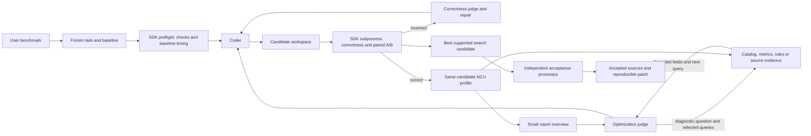

# Architecture

KAI Pichu separates operator semantics, measured evidence and optimization policy.
Only the benchmark owns the workload, oracle, tolerances, metric and acceptance.
Only the optimization loop chooses what implementation to propose next.

The NCU stage is optional. Missing profiles are reported as unavailable evidence;
the judge must not invent hardware counters. NCU uses the benchmark adapter's
search case and the same implementation workspace as the code in its prompt.
The profile range excludes compilation, input setup, reset, warmup and oracle
evaluation. Profiling results never determine the speedup score.
Captures retain both NCU reports and base-unit CSV. The optional NCU report adapter
provides description search, rule findings and source/instruction queries;
CSV supports a limited structured fallback. Report hashes bind cached queries
to their original evidence. See the [AI profiling protocol](../src/kai_pichu/PROFILE_GUIDE.md).

## Optimization loop

`kai_pichu.optimizer` manages candidate generation, correctness repair, performance
diagnosis and selection. It consumes frozen benchmark contracts and structured SDK
reports, and keeps candidate state separate from measurement and model transport.

The agent's context holds the manifest, the editable sources and only the files
listed in `agent_files`. Adapter, oracle and input generation are never shown, so
a candidate cannot read the test distribution off the benchmark code.

The candidate is a JSON map of complete file replacements. Existing source files
are the editable allowlist. Missing replacements inherit the selected anchor;
new files, absolute paths, traversal and benchmark edits are rejected before
materialization. Each round has its own source directory and report paths.

All score decisions consume structured SDK reports. A correct but slower candidate
can inform further search, but cannot displace a supported improvement. Best
selection requires a lower confidence bound above 1 and satisfied per-case/resource
constraints. A configured larger speedup target is checked during final acceptance.

## Reliability and operational limits

- Every evaluation is a separate process group with a deadline. Build errors,
  wrong outputs, process crashes and timeouts produce explicit feedback.
- GPU polling before, during and after evaluation rejects resource conflicts.
  This is not an exclusive lease and cannot observe all interference between polls.
- The frozen benchmark/baseline hash is verified around evaluation and profiling.
- Checkpoints are atomic and a local file lock prevents concurrent resume.
- A reserved incomplete round is skipped after an interruption. It is retained
  on disk and remains charged to the budget; no attempt is silently overwritten.
- Final source is selected before independent acceptance and is not retuned using
  acceptance feedback. A resumed acceptance stage starts a fresh set of reports.
- The user must provide a correct reset and an independent oracle. Trusted native
  code can still access the host; source boundaries are not a hostile-code sandbox.

The model interface accepts chat-completions-compatible HTTP services, the
OpenAI Responses API (`provider: responses`, with `store: false`) and Claude
through the official Anthropic SDK (`provider: anthropic`, optional dependency
`kai-pichu[anthropic]`; adaptive thinking, no sampling parameters, refusals and
truncated answers reported as model errors, no fallback models).
`provider: replay` supplies deterministic recorded text for offline control-flow
tests. Replay output is not model performance evidence. SDK CPU/mocked CUDA tests
and real GPU/model optimization are separate validation claims.
